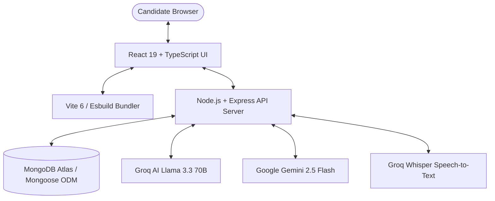

# 🚀 NexHire — Enterprise AI Career & Technical Placement Platform

[](https://www.typescriptlang.org/)
[](https://react.dev/)
[](https://expressjs.com/)
[](https://www.mongodb.com/)
[](https://groq.com/)
[](https://ai.google.dev/)
[](https://nexhire-chi.vercel.app)
[](LICENSE)

---

## 📌 1. Executive Summary & Overview

**NexHire** is an enterprise-grade, full-stack AI career acceleration and placement readiness platform designed to bridge the gap between technical candidates, resume screening, and corporate hiring loops. 

Built using a high-performance **React 19 + TypeScript** frontend and a **Node.js / Express** backend, NexHire integrates state-of-the-art Large Language Models (**Groq Llama 3.3 70B** and **Google Gemini 2.5 Flash**) alongside browser-native speech recognition and audio synthesis. 

### Core Value Proposition
- **Automated Resume Engineering**: Deep multi-strategy PDF/DOCX parsing, ATS compatibility calculation, STAR metric alignment, and instant bullet optimization.
- **Voice-Enabled AI Technical Interviews**: Real-time conversational interview loops simulating FAANG-level engineering discussions and spoken English fluency analysis with instant audio transcription.
- **In-Browser Multi-Language DSA Compiler**: Algorithmic problem-solving sandbox supporting C++, Python, JavaScript, Java, Go, Rust, and TypeScript with telemetry and streak tracking.
- **24/7 AI Career Co-pilot**: Low-latency technical mentorship streaming advice on system design, architecture trade-offs, and career roadmap planning.
- **Direct Placement Pipeline**: Automated matching algorithm (NexScore) connecting candidate readiness metrics directly to job application pipelines.

---

## 🛠️ 2. Core Functional Modules

### 2.1 🎙️ NexInterview — Vocal AI Mock Interview & Fluency Engine
- **Dual Evaluation Pipelines**:
  1. **Technical Role Interview Loop**: Simulates realistic engineering interviews across Full Stack, Backend, System Design, Frontend, and Cloud Architecture.
  2. **Conversational Spoken English & Vocal Fluency Mode**: Analyzes spoken grammar, vocabulary richness, sentence articulation, and filler word frequency (*"um"*, *"like"*, *"basically"*).
- **Speech-to-Text (STT) & Speech Synthesis (TTS)**:
  - Captures real-time audio streams via the Web Speech API and Groq Whisper (`whisper-large-v3`).
  - Reads AI interviewer responses aloud using native browser speech synthesis (`SpeechSynthesisUtterance`).
- **8-Vector Deep Assessment Matrix**: Evaluates candidate answers in real-time across:
  - Technical Accuracy (0–100)
  - Communication Quality (0–100)
  - Confidence Score (0–100)
  - Answer Clarity (0–100)
  - Answer Depth (0–100)
  - Structure & Organization (0–100)
  - Real-World Examples Used (0–100)
  - Problem Solving Reasoning (0–100)
- **Comprehensive Post-Interview Report**: Generates an instant report with overall placement hiring recommendations (*Strong Hire*, *Hire*, *Weak Hire*, *No Hire*), identified strengths, weaknesses, sample optimal answers, and a structured 30-day improvement roadmap.

---

### 2.2 📄 NexResume — AI ATS Resume Studio & Parser
- **Multi-Format Text Extraction**: Uses a resilient dual-strategy parsing engine combining `pdf-parse@2.x` and `mammoth` (DOCX extraction) with raw buffer regex fallback parsing.
- **ATS Compatibility Scoring**: Analyzes resume content against industry job descriptions, extracting keywords, quantifiable metrics, and missing technical competencies.
- **STAR Method Optimizer**: Automatically rewrites passive bullet points into high-impact, metric-driven achievements (*Situation, Task, Action, Result*).

---

### 2.3 💻 NexCode — Multi-Language DSA Sandbox
- **In-Browser Execution Engine**: Interactive code editor with support for C++, Python, JavaScript, Java, Go, Rust, and TypeScript.
- **Test Case Telemetry**: Runs candidate solutions against public and hidden test cases, returning runtime execution speeds (ms), memory footprint, and detailed compiler output.
- **Streak & XP Rewards**: Tracks daily algorithmic problem-solving streaks and updates user XP scores dynamically.

---

### 2.4 🤖 NexMentor — 24/7 AI Technical Career Co-pilot
- **Dual LLM Architecture**:
  - **Primary**: Groq Llama 3.3 70B Versatile for sub-second TTFT (Time To First Token) responses.
  - **Fallback**: Google Gemini 2.5 Flash for deep system design reasoning.
- **Technical Mentorship**: Assists candidates with architecture trade-offs, code reviews, resume strategy, and interview preparation.

---

### 2.5 📊 Placement Cockpit & NexScore Engine
- **Unified Placement Dashboard**: Synthesizes candidate metrics into a single real-time Readiness Score (0–100%).
- **Dynamic New-User Defaulting**: New candidates start with clean, uninflated metrics (`0% / Not Analyzed / Pending`), which dynamically populate as real resume scans and mock interviews are completed in MongoDB.
- **Kanban Application Tracker**: Tracks job applications across status stages (*Matched*, *Applied*, *Screening*, *Interview*, *Offered*, *Rejected*).

---

## 🏗️ 3. Technology Stack & Dependencies



### Tech Stack Breakdown
| Layer | Technology Used | Version | Purpose |
| :--- | :--- | :--- | :--- |
| **Frontend UI** | React, TypeScript, TailwindCSS v4 | 19.0, 5.8 | Modern, responsive glassmorphic UI |
| **UI Components** | Lucide React, Motion (Framer) | Latest | Micro-animations, icons, interactive cards |
| **Backend Runtime** | Node.js, Express.js | 20.x, 4.21 | RESTful API routes & serverless function execution |
| **Database & ORM** | MongoDB Atlas, Mongoose ODM | 9.x | Persistent user profiles, mock interviews, and application data |
| **AI LLM Inference** | Groq AI (`llama-3.3-70b-versatile`) | API v1 | Ultra-fast text evaluation and ATS analysis |
| **AI Fallback LLM** | Google Gemini (`gemini-2.5-flash`) | `@google/genai` | Complex system design reasoning and technical coaching |
| **Audio Processing** | Web Speech API, Groq Whisper | Native | Browser voice synthesis (TTS) & speech transcription |
| **File Parsing** | `pdf-parse`, `mammoth` | 2.x, 1.8 | PDF and DOCX text extraction |
| **Build System** | Vite 6, Esbuild, Vercel `@vercel/node` | Latest | High-speed frontend compilation & serverless deployment |

---

## 📂 4. Project Directory Structure

```
nexhire/
├── api/                          # Vercel Serverless Function Handler
│   └── index.ts                  # Serverless Express API Entrypoint
├── server/                       # Node.js Express Core Backend
│   ├── controllers/              # Thin Request/Response Controllers
│   │   └── interviewController.ts # Interview Initialization & Transcription Controllers
│   ├── middleware/               # Express Security & Auth Middlewares
│   │   └── auth.ts               # JWT Token Verification Middleware
│   ├── models/                   # Mongoose Database Schemas
│   │   └── MockInterview.ts      # Unified Mock Interview Collection Model
│   ├── routes/                   # RESTful API Endpoint Routers
│   │   ├── auth.ts               # Local Credentials & Google/GitHub OAuth Routes
│   │   ├── dsa.ts                # In-Browser Code Execution & Problem Routes
│   │   ├── interview.ts          # NexInterview Vocal Pipeline Routes
│   │   ├── jobs.ts               # Kanban Application Pipeline Routes
│   │   ├── mentor.ts             # NexMentor AI Chatbot Routes
│   │   ├── resume.ts             # PDF/DOCX Resume Parsing & ATS Analysis Routes
│   │   └── user.ts               # Profile Management & User Stats Routes
│   ├── services/                 # Core AI & Business Services
│   │   ├── aiInterviewService.ts # Groq/Gemini Evaluation & Audio Engines
│   │   └── interviewService.ts   # Session State Persistence & Reporting Engine
│   ├── utils/                    # Helper Modules
│   │   └── mailer.ts             # Email OTP Verification Helper
│   └── db.ts                     # MongoDB Connection & Mongoose Models (User, Application, DSA)
├── src/                          # React Frontend Application
│   ├── components/               # Feature Components
│   │   ├── AIMockInterview.tsx   # Voice Interview Studio Component
│   │   ├── AIResumeStudio.tsx    # Resume Optimization Dashboard
│   │   ├── CommandPalette.tsx    # Universal Ctrl+K Navigation Palette
│   │   ├── DashboardOverview.tsx # Interactive Placement Metrics & Hero Cockpit
│   │   ├── GitHubAuth.tsx        # GitHub OAuth Account Chooser
│   │   ├── GoogleAuth.tsx        # Google OAuth Account Chooser
│   │   ├── NexMentor.tsx         # AI Mentor Chat Interface Component
│   │   └── NotificationPanel.tsx # System Notifications Drawer
│   ├── pages/                    # Main View Router Pages
│   │   ├── Dashboard.tsx         # Main Placement Application Shell
│   │   ├── Landing.tsx           # Product Marketing & Showcase Landing Page
│   │   ├── Login.tsx             # User Sign-In Page
│   │   └── Signup.tsx            # Candidate Registration Page
│   ├── types/                    # Shared TypeScript Type Definitions
│   │   └── index.ts              # System State Interfaces
│   ├── index.css                 # Tailwind CSS Design System & Utility Tokens
│   └── main.tsx                  # React DOM Root Mounting Entrypoint
├── public/                       # Static Public Assets
├── .env.example                  # Environment Variables Template
├── .env.local                    # Local Environment Secrets File (Git-ignored)
├── package.json                  # Node.js Dependencies & NPM Scripts
├── server.ts                     # Main Express Server Entrypoint (Local Dev & Docker)
├── tsconfig.json                 # TypeScript Configuration
├── vercel.json                   # Vercel Deployment & Route Rewrites Configuration
└── vite.config.ts                # Vite Frontend Bundler Configuration
```

---

## 🗄️ 5. Database Schema Architecture (MongoDB / Mongoose)

NexHire uses custom string `_id` schemas to allow seamless custom string ID creation (e.g., `usr_demo123`, `int_172000000`) without triggering Mongoose BSON `CastError`s:

### 5.1 User Schema (`users` collection)
```typescript
{
  _id: { type: String, required: true },
  name: { type: String, required: true },
  email: { type: String, required: true, unique: true },
  college: String,
  graduationYear: String,
  targetRole: String,
  avatar: String,
  resumeScore: { type: Number, default: 0 },
  dsaSolvedCount: { type: Number, default: 0 },
  interviewsCompleted: { type: Number, default: 0 },
  streakDays: { type: Number, default: 0 },
  passwordHash: String,
  passwordSalt: String,
  createdAt: { type: String, required: true }
}
```

### 5.2 Unified Mock Interview Schema (`unifiedmockinterviews` collection)
```typescript
{
  _id: { type: String, required: true },
  userId: { type: String, required: true },
  role: { type: String, required: true },
  company: { type: String, default: "Tech Company" },
  experienceLevel: { type: String, default: "Mid-level" },
  interviewType: { type: String, default: "Technical & System Design" },
  difficulty: { type: String, default: "Medium" },
  status: { type: String, enum: ["in_progress", "completed"], default: "in_progress" },
  currentQuestionNumber: { type: Number, default: 1 },
  totalQuestions: { type: Number, default: 5 },
  currentQuestion: { type: String, default: "" },
  messages: [{
    id: String,
    sender: { type: String, enum: ["AI", "User"] },
    question: String,
    answer: String,
    transcript: String,
    duration: Number,
    evaluation: {
      technicalScore: Number,
      communicationScore: Number,
      confidenceScore: Number,
      clarityScore: Number,
      depthScore: Number,
      structureScore: Number,
      examplesScore: Number,
      problemSolvingScore: Number,
      strengths: [String],
      weaknesses: [String],
      betterAnswer: String,
      feedback: String
    },
    timestamp: String
  }],
  report: {
    overallScore: Number,
    technicalScore: Number,
    communicationScore: Number,
    confidenceScore: Number,
    problemSolvingScore: Number,
    behavioralScore: Number,
    grammarScore: Number,
    vocabularyScore: Number,
    fluencyScore: Number,
    strengths: [String],
    weaknesses: [String],
    recruiterFeedback: String,
    hiringRecommendation: String,
    improvementPlan: [String],
    suggestedTopics: [String],
    fillerWords: [String]
  },
  startedAt: String,
  completedAt: String,
  createdAt: String
}
```

---

## 🔌 6. REST API Endpoint Reference

### Authentication (`/api/auth`)
| Method | Route | Description | Auth Required |
| :--- | :--- | :--- | :---: |
| `POST` | `/api/auth/register` | Create a new user account | ❌ |
| `POST` | `/api/auth/login` | Authenticate candidate & issue JWT token | ❌ |
| `GET` | `/api/auth/google` | Initiate Google OAuth 2.0 flow | ❌ |
| `GET` | `/api/auth/google/callback` | Handle Google OAuth 2.0 redirect | ❌ |
| `GET` | `/api/auth/github` | Initiate GitHub OAuth 2.0 flow | ❌ |
| `GET` | `/api/auth/github/callback` | Handle GitHub OAuth 2.0 redirect | ❌ |

### AI Resume Studio (`/api/resume`)
| Method | Route | Description | Auth Required |
| :--- | :--- | :--- | :---: |
| `POST` | `/api/resume/analyze` | Upload & analyze PDF/DOCX resume file | ✅ |
| `POST` | `/api/resume/optimize-bullet` | Rewrite resume bullet into STAR format | ✅ |
| `GET` | `/api/resume/latest` | Retrieve candidate's latest ATS resume report | ✅ |

### AI Mock Interview (`/api/interview`)
| Method | Route | Description | Auth Required |
| :--- | :--- | :--- | :---: |
| `POST` | `/api/interview/start` | Initialize a new voice mock interview session | ✅ |
| `POST` | `/api/interview/transcribe` | Transcribe recorded audio blob via Groq Whisper | ✅ |
| `POST` | `/api/interview/answer` | Evaluate candidate response & get follow-up question | ✅ |
| `POST` | `/api/interview/english-fluency` | Evaluate spoken English fluency & filler words | ✅ |
| `POST` | `/api/interview/end` | Generate final comprehensive interview report | ✅ |
| `GET` | `/api/interview/history` | Fetch candidate's past interview session history | ✅ |

### AI Technical Mentor (`/api/mentor`)
| Method | Route | Description | Auth Required |
| :--- | :--- | :--- | :---: |
| `POST` | `/api/mentor/chat` | Send query to NexMentor AI Technical Coach | ✅ |

### In-Browser DSA Sandbox (`/api/dsa`)
| Method | Route | Description | Auth Required |
| :--- | :--- | :--- | :---: |
| `GET` | `/api/dsa/problems` | List available DSA practice challenges | ✅ |
| `POST` | `/api/dsa/run` | Execute code against problem test cases | ✅ |

### User Profile & Stats (`/api/user`)
| Method | Route | Description | Auth Required |
| :--- | :--- | :--- | :---: |
| `GET` | `/api/user/profile` | Fetch complete MongoDB user profile record | ✅ |
| `PUT` | `/api/user/profile` | Update profile information (college, target role) | ✅ |
| `GET` | `/api/user/stats` | Fetch aggregated placement stats & streaks | ✅ |

---

## 🔒 7. Security & OAuth 2.0 Host Resolution

### Secure Password Storage
Passwords are encrypted using Node's cryptographic `scryptSync` algorithm with unique per-user cryptographically random 16-byte salts:
```typescript
function hashPassword(password: string, salt: string): string {
  return crypto.scryptSync(password, salt, 64).toString("hex");
}
```

### Dynamic Request Host Resolution (`getBaseUrl`)
To prevent OAuth redirect URL mismatches across different environments (localhost, Vercel, Render), the backend dynamically extracts incoming host headers:
```typescript
export function getBaseUrl(req: Request): string {
  const forwardedHost = req.headers["x-forwarded-host"] as string;
  const host = forwardedHost || req.get("host") || "localhost:3000";
  const protocol = req.headers["x-forwarded-proto"] || (host.includes("localhost") ? "http" : "https");
  return `${protocol}://${host}`;
}
```

---

## ⚙️ 8. Local Development Setup Guide

### 8.1 Prerequisites
- **Node.js**: v18.x or higher
- **npm** or **pnpm**
- **MongoDB**: Local MongoDB instance or free MongoDB Atlas cluster

### 8.2 Clone & Install Dependencies
```bash
git clone https://github.com/theArshGupta/Nexhire.git
cd Nexhire
npm install
```

### 8.3 Configure Local Environment (`.env.local`)
Create a `.env.local` file in the root directory:
```env
PORT=3000
MONGODB_URI=mongodb+srv://<username>:<password>@cluster0.example.mongodb.net/nexhire
JWT_SECRET=your_super_secret_jwt_key
GROQ_API_KEY=gsk_your_groq_api_key
GEMINI_API_KEY=your_gemini_api_key
GOOGLE_CLIENT_ID=your_google_client_id.apps.googleusercontent.com
GOOGLE_CLIENT_SECRET=your_google_client_secret
GITHUB_CLIENT_ID=your_github_client_id
GITHUB_CLIENT_SECRET=your_github_client_secret
```

### 8.4 Run Development Server
```bash
npm run dev
```
Open [http://localhost:3000](http://localhost:3000) in your browser.

---

## 📦 9. Production Build & Deployment

### 9.1 Build Command
Compiles frontend assets to `dist/` and bundles server TypeScript code with Esbuild:
```bash
npm run build
```

### 9.2 Deploying to Vercel (Recommended)
1. Import `theArshGupta/Nexhire` into **Vercel**.
2. Root Directory: `./` (Default)
3. Add Environment Variables (`MONGODB_URI`, `GROQ_API_KEY`, `GEMINI_API_KEY`, `JWT_SECRET`, `GOOGLE_CLIENT_ID`, `GOOGLE_CLIENT_SECRET`).
4. Click **Deploy**. Vercel uses `api/index.ts` to execute serverless API routes automatically.

---

## 📜 10. License

This project is open-source under the [MIT License](LICENSE). Built with ❤️ by **Arsh Gupta**.
